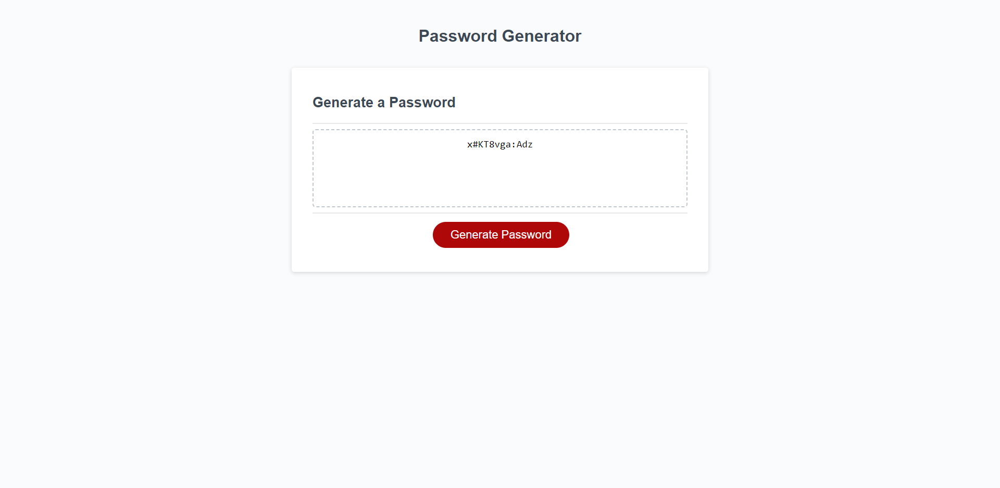

# random-password-generator

## Description 
This is an app that runs in the browser and features dynamically updated HTML and CSS, all powered by JavaScript code that I have written. The functionality of this website, is to generate a random password after collating user inputs through a series of prompts for password preferences. The password has specific criteria that it has to meet which are: having a password length of 10-64 character and include special, numeric, lowercase and uppercase characters.

## Screenshot

## Link to the deployed site 
[random-password-generator](https://natasha-16x.github.io/random-password-generator/)

## Installation 
N/a

## Usage 
To use this application:
1) Open the random password generator in your browser.
2) Select the red "Generate Password" buttton.
3) Answer the prompts for password preferences
4) Your random password should display in the text box

## Credits 
N/a

## License
MIT License
